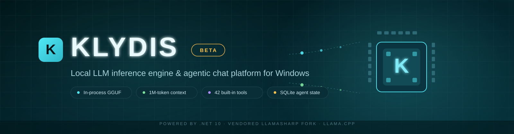
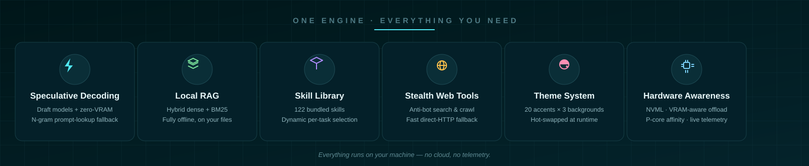
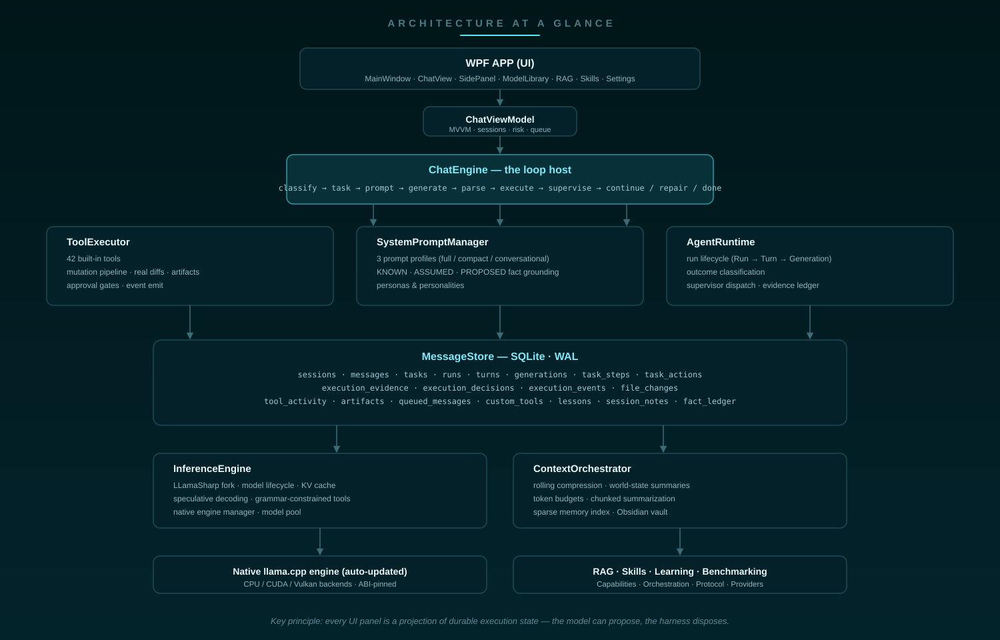
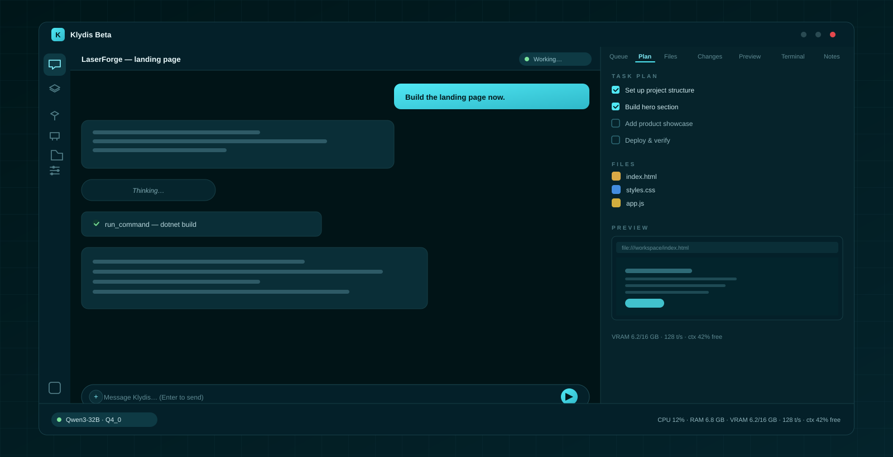
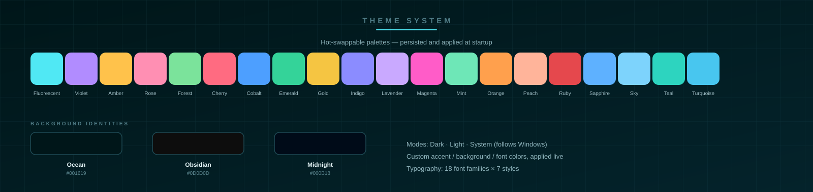

# Klydis Beta

**A high-performance, self-contained LLM inference engine & agentic chat platform for Windows.**

Klydis is a modern, dark-first WPF desktop application engineered for zero-latency, private
Large Language Model (LLM) execution directly on local Windows hardware. Powered by **.NET 10**
and a vendored fork of **LLamaSharp** (see [`patches/README.md`](patches/README.md)), Klydis
operates with an **in-process inference engine** — eliminating the overhead, network leaks, and
IPC latency of external local servers (like Ollama or LM Studio).

Klydis is not just a chat UI around a model: it is an **agentic execution system** that uses
the model as its decision engine. It classifies every user message, maintains durable task
state (plan, runs, steps, tool activity, artifacts, execution events) in SQLite, supervises
the model's progress against that state, and projects everything onto a live workbench
(plan / files / changes / preview / terminal). The harness — not the model — decides what
counts as progress and what counts as completion.

<p align="center">
  
</p>

---

## Contents

1. [Highlights](#highlights)
2. [Feature inventory](#feature-inventory)
3. [Quick start](#quick-start)
4. [Where things live (data & config)](#where-things-live-data--config)
5. [Architecture](#architecture)
   - [Layer diagram](#layer-diagram)
   - [Core components](#core-components)
   - [State ownership & persistence](#state-ownership--persistence)
   - [Dependency injection & startup](#dependency-injection--startup)
6. [The interaction model: Conversation / Task / Autonomous](#the-interaction-model-conversation--task--autonomous)
7. [The chat loop](#the-chat-loop)
8. [The autonomous task loop (Planner → Executor → Supervisor)](#the-autonomous-task-loop-planner--executor--supervisor)
9. [Progress = state change (the no-action gate)](#progress--state-change-the-no-action-gate)
10. [Goal mode (GoalOrchestrator)](#goal-mode-goalorchestrator)
11. [Context & memory orchestration](#context--memory-orchestration)
12. [Inference engine](#inference-engine)
13. [Protocol, templating & grammar layers](#protocol-templating--grammar-layers)
14. [Orchestration & routing layer](#orchestration--routing-layer)
15. [Capabilities & epistemic subsystem](#capabilities--epistemic-subsystem)
16. [Cloud / remote providers](#cloud--remote-providers)
17. [Durable execution state (SQLite)](#durable-execution-state-sqlite)
18. [Tool protocol & risk model](#tool-protocol--risk-model)
19. [The workbench](#the-workbench)
20. [Web tools (stealth browser)](#web-tools-stealth-browser)
21. [RAG: local retrieval-augmented generation](#rag-local-retrieval-augmented-generation)
22. [Skill library](#skill-library)
23. [Model library & management](#model-library--management)
24. [Hardware awareness](#hardware-awareness)
25. [Performance engineering](#performance-engineering)
26. [Benchmarking](#benchmarking)
27. [Adaptive learning](#adaptive-learning)
28. [Processes & terminal sessions](#processes--terminal-sessions)
29. [Updates & diagnostics](#updates--diagnostics)
30. [Theming](#theming)
31. [Settings reference](#settings-reference)
32. [The UI surface](#the-ui-surface)
33. [Repository layout](#repository-layout)
34. [Testing](#testing)
35. [Building & publishing](#building--publishing)
36. [Contributing](#contributing)

---

## Highlights

- **⚡ In-process inference engine** — loads and runs `.gguf` models directly inside the
  application process using a vendored LLamaSharp fork; no external server, no IPC.
- **🤖 Three interaction modes** — `Conversation`, `Task`, and `Autonomous` are selected
  deterministically per message, so a greeting never spins up the agent runtime and a build
  request never degrades into chit-chat.
- **🗂 Durable agentic execution state** — sessions, messages, tasks, runs, turns,
  generations, typed steps, an action ledger, evidence, plan checklists, tool activity,
  artifacts, file diffs, and execution events all persist to SQLite (19 tables) and survive
  restarts.
- **🧠 Supervisor-owned completion** — the model proposes; the harness disposes. Completion
  claims are verified against the plan checklist; text with no state change is not progress.
- **🔧 42 built-in tools** — file read/write/edit/patch, PowerShell, background process
  management, system diagnostics, web search/crawl, RAG search, memory, skills, message
  queue, custom tool creation, plan maintenance, and more.
- **💾 Context orchestration** — rolling compression, world-state summaries, prompt
  budgeting, and KV-cache-aware sizing keep long-horizon tasks inside the model's window
  (up to 1M tokens).
- **🏎️ Speculative decoding** — draft-model speculation with a zero-VRAM N-gram prompt-lookup
  fallback, dynamic candidate windows, and acceptance-rate tracking.
- **🖥️ Hardware awareness** — NVIDIA NVML GPU profiling, VRAM-aware layer offloading, P-core
  CPU affinity, and a system profiler that adapts the engine to the machine.
- **📚 Local RAG** — index local folders (PDF, TXT, Markdown, code) into a SQLite vector
  store with hybrid dense + BM25 retrieval, fully offline.
- **🛠️ Skill library** — 122 bundled skills (UI/UX, web, Windows automation, engineering
  practices) plus a custom skill creator and dynamic skill selection.
- **🧠 Cross-session learning** — lessons learned during tasks are persisted and re-injected
  into future sessions for the same model.
- **🌐 Stealth web tools** — `search_web` / `crawl_url` through a stealth Chromium that
  evades bot detection, with a fast direct-HTTP fallback.
- **🎨 Theme system** — 20 accent themes × 3 background identities, Dark/Light/System modes,
  custom colors, and full typography control, hot-swappable at runtime.
- **🛡️ Safety & forensic tooling** — three tool-risk levels with per-call approval gates,
  workspace-boundary validation, crash forensics, and rotating logs.

<p align="center">
  
</p>

---

## Feature inventory

| Area | Capability |
|---|---|
| Inference | In-process GGUF execution (LLamaSharp fork), KV-cache quantization (F16 → 3-bit), prefix caching, speculative decoding with N-gram fallback, grammar-constrained tool calls |
| Model management | GGUF discovery with hot-reload, Hugging Face browse/search/download (resumable), metadata reading, in-place 4-bit quantization, multi-model pool |
| Agentic runtime | Conversation/Task/Autonomous classification, durable tasks/runs/turns/generations, typed steps, plan engine, supervisor decisions, evidence & verification, recovery state machine |
| Context | Token budgeting, rolling compression to world state, chunked summarization, sparse memory index, Obsidian vault integration, execution-state contract |
| Tools | 42 built-in tools across files, shell, web, system, RAG, skills, memory, queue, task lifecycle; custom PowerShell/Python/C# tools |
| Persistence | SQLite WAL: 19 tables + FTS5 message index; every projection (plan/files/changes/preview/terminal) is durable state |
| Web | Stealth Chromium (fingerprint evasion, optional Camoufox) with fast direct-HTTP fallback |
| RAG | Folder ingestion (PDF/TXT/MD/code), local embeddings, hybrid dense+BM25 retrieval |
| Skills | 122 bundled skills + submodule extras, dynamic relevance-based selection, custom skill creation |
| UI | Multi-session chat, streaming with thinking blocks, attachments (files/images/audio/text/screenshots), 7-tab workbench, hardware monitor, settings |
| Theming | 20 accents × 3 backgrounds × 3 modes, custom colors, fonts, instant hot-swap, persistence |
| Observability | Live tokens/s, VRAM, context gauges, benchmark runner, crash forensics, rotating app log |
| Updates | Auto-updating native llama.cpp engine (daily-throttled), NuGet dependency update checker |

---

## Quick start

### Prerequisites

- **OS:** Windows 10 / 11 (64-bit)
- **SDK:** [.NET 10.0 SDK](https://dotnet.microsoft.com/download/dotnet/10.0) or higher
- **GPU (optional):** NVIDIA GPU with CUDA 12 drivers — automatic CPU fallback via AVX2/AVX-512.
  CUDA runtime DLLs are discovered on `PATH`, in the NVIDIA toolkit install, the NVIDIA App
  G-Assist folder, and the legacy NVIDIA CEF folder.

### Run

```cmd
.\Start-Klydis.bat          # recommended: dev env + diagnostic logging
dotnet run --project src/Klydis.App/Klydis.App.csproj
```

Or open `KlydisBeta.sln` in Visual Studio 2022+ / Rider and run `Klydis.App`.

`Start-Klydis.bat` sets `DOTNET_ENVIRONMENT=Development`, default log level `Debug`, and
`Microsoft`-namespace logs at `Information`.

### First model

1. **Download a GGUF model** (e.g. Qwen, Llama 3, Mistral, DeepSeek distills) from
   Hugging Face — either through the in-app **Model Library** tab or manually.
2. Place `.gguf` files in `%USERPROFILE%\.klydis\models` (the app hot-reloads this folder via
   a file watcher).
3. Open the **Models** tab → **Refresh** → **Load Model** (or pick it from the status-bar
   model selector in the Chat tab).
4. Tune GPU offloading and context in **Settings** (auto-offload and auto context are
   available) and monitor live VRAM in the bottom-right status bar.

### Publish a release build

```powershell
powershell -ExecutionPolicy Bypass -File .\build.ps1
# Output: src\Klydis.App\bin\Release\net10.0-windows\win-x64\publish\
```

The build script publishes win-x64 self-contained and prunes non-Windows native binaries
that leak in from the LLamaSharp backend packages (Cloudflare edge-caches objects only up to
512 MB). It deliberately does **not** use `PublishSingleFile`, because the app loads native
DLLs (`llama.dll` / `ggml*.dll`) at runtime and single-file extraction breaks that lookup.

---

## Where things live (data & config)

| Path | Purpose |
|---|---|
| `%USERPROFILE%\.klydis\models` | GGUF model files (watched for hot-reload) |
| `%USERPROFILE%\.klydis\data\` | SQLite database (`MessageStore`): sessions, messages, tasks, runs, tools, artifacts, … (WAL mode) |
| `%USERPROFILE%\.klydis\native\` | Auto-updated native llama.cpp engine (`llama.dll`, `ggml*.dll`), deployed/overridden here and synced into the app output |
| `%USERPROFILE%\.klydis\skills\` | User-writable skill library (seeded from bundled skills on first run) |
| `%USERPROFILE%\.klydis\` | Optional `klydis local system prompt.md` and `UserStyle_Modes.md` overrides (also loaded from the working dir and app dir) |
| `%LOCALAPPDATA%\Klydis\ui-settings.json` | Persisted UI/model settings (theme, fonts, context limit, speculation, personality) |
| `%LOCALAPPDATA%\Klydis\logs\` | `fatal_error.txt` (crash forensics), `app.log` (rotating ILogger mirror), `llama_native.log` (rotating native engine log) |
| `.klydis\models` (project dir) | Alternative model folder (also scanned) |

The native engine auto-update runs behind the splash screen on startup, is daily-throttled,
and is guarded by a 90-second watchdog: if the sync/update cannot finish in time, Klydis
starts with the current engine and retries on the next launch.

---

## Architecture

### Layer diagram

<p align="center">
  
</p>

**Key principle:** every UI panel is a *projection* of durable execution state. The Plan tab
is the persisted checklist; the Files/Changes/Preview/Terminal tabs are projections of
`tool_activity`, `file_changes`, `artifacts`, and `execution_events`. Nothing in the UI
invents state from narration.

### Core components

| Component | File | Responsibility |
|---|---|---|
| `ChatEngine` | `src/Klydis.Core/Chat/ChatEngine.cs` | Loop host: mode classification, task resolution, prompt assembly, inference dispatch, streaming, tool execution, continuation/repair, persistence. The `while (iterationCount < maxIterations)` loop is the single place the next autonomous iteration starts. |
| `ToolExecutor` | `src/Klydis.Core/Chat/ToolExecutor.cs` | 42 built-in tools, approval gates, validation, the file-mutation pipeline (snapshot → diff → artifact → events), tool-output disk offloading. |
| `SystemPromptManager` | `src/Klydis.Core/Chat/SystemPromptManager.cs` | Prompt construction: full / compact / conversational profiles, KNOWN/ASSUMED/PROPOSED fact grounding, persona & personality injection, tool schema. |
| `AgentRuntime` | `src/Klydis.Core/Tasks/AgentRuntime.cs` | Run lifecycle (Task → Run → Turn → Generation), outcome classification, durable action ledger, evidence ledger, supervisor dispatch. |
| `AgentSupervisor` | `src/Klydis.Core/Tasks/AgentSupervisor.cs` | Pure, deterministic decision layer: completion gate (`EvaluateCompletion` — plan checklist must be empty), eligibility, `DecideAfterTurn`. |
| `TaskManager` | `src/Klydis.Core/Tasks/TaskManager.cs` | Task resolution (new / steer / reopen), creation, persistence, plan management. |
| `InteractionClassifier` | `src/Klydis.Core/Tasks/InteractionClassifier.cs` | Deterministic, tiered message → mode classification. |
| `TaskStateMachine` | `src/Klydis.Core/Tasks/TaskStateMachine.cs` | Task/Run state enums and legal transition enforcement. |
| `AgentLoopStateMachine` | `src/Klydis.Core/Tasks/AgentLoopStateMachine.cs` | OODA-VR phase transitions (Observe → Orient → Decide → Act → Verify → Reflect). |
| `ActionGate` | `src/Klydis.Core/Tasks/ActionGate.cs` | Pre-execution validation: tool existence, step restriction, schema, replay protection, workspace boundary. |
| `StepClassifier` / `TaskStep` | `src/Klydis.Core/Tasks/` | First-class typed steps with `StepActionKind`, `AllowedTools`, `VerificationCriteria`. |
| `ExecutionEvidenceLedger` | `src/Klydis.Core/Tasks/ExecutionEvidenceLedger.cs` | Run-scoped, versioned verification evidence with durable persistence and stale invalidation. |
| `RecoveryStateMachine` | `src/Klydis.Core/Tasks/RecoveryStateMachine.cs` | Self-healing: bounded tool/schema/model repair attempts, same-action retry suppression. |
| `InferenceEngine` | `src/Klydis.Core/Inference/InferenceEngine.cs` | LLamaSharp wrapper: model lifecycle, KV cache, speculative decoding, telemetry, grammar-constrained sampling. |
| `ContextOrchestrator` | `src/Klydis.Core/Memory/ContextOrchestrator.cs` | Token budgeting, rolling compression, world state, chunked summarization, memory index. |
| `MessageStore` | `src/Klydis.Core/Memory/MessageStore.cs` | SQLite persistence layer (WAL), 19 tables, FTS5 message index. |
| `DynamicSkillSelector` | `src/Klydis.Core/Skills/DynamicSkillSelector.cs` | Brain-index generation, relevance scoring, per-task skill activation. |
| `ProcessManager` | `src/Klydis.Core/Processes/ProcessManager.cs` | Background process management with bounded ring buffers. |
| `TerminalSessionManager` | `src/Klydis.Core/Processes/TerminalSessionManager.cs` | Persistent terminal sessions across turns. |
| `NativeEngineManager` | `src/Klydis.Core/Inference/NativeEngineManager.cs` | Native llama.cpp engine deployment, daily-throttled auto-update, CUDA runtime syncing. |

### State ownership & persistence

**The database is always the authority.** In-memory collections in `ToolExecutor`,
`AgentRuntime`, and `ExecutionEvidenceLedger` are caches, not authorities.

| State | In-memory owner | Persistence table |
|---|---|---|
| Sessions / messages | `ChatEngine` | `sessions`, `messages` (+ FTS5) |
| Tasks / plans | `TaskManager` / `ToolExecutor` | `tasks` (`plan_json`) |
| Runs / turns / generations | `AgentRuntime` | `runs`, `turns`, `generations` |
| Typed steps | `TaskStepBuilder` | `task_steps` |
| Actions (replay ledger) | `AgentRuntime` | `task_actions` (`replay_key`) |
| Evidence / decisions | `ExecutionEvidenceLedger` | `execution_evidence`, `execution_decisions` |
| Events / diffs / tool activity / artifacts | `ToolExecutor` | `execution_events`, `file_changes`, `tool_activity`, `artifacts` |
| Queue / custom tools / lessons / notes | `ModelMessageQueue` / `ToolExecutor` / `AdaptiveLearningService` | `queued_messages`, `custom_tools`, `lessons`, `session_notes` |
| World state | `ContextOrchestrator` | `sessions.world_state` |
| Facts (epistemic) | `FactLedger` | `fact_ledger` |

### Dependency injection & startup

`Klydis.App/App.xaml.cs` registers everything in a single `ServiceCollection`:

- **Engine chain** — `InferenceEngine` (with `SpeculativeDecodingService`, `NativeResourceDisposer`)
  → `ChatEngine` (with `PromptTemplateEngine`, `ToolExecutor`, `MessageStore`,
  `ContextOrchestrator`, `ModelMessageQueue`, `AdaptiveLearningService`, `TaskManager`,
  `AgentRuntime`).
- **Agentic services** — `TaskManager`, `AgentRuntime` (+ `IAgentRuntime`), `TaskEventBus`,
  `WorkspaceVersionManager`, `TaskWorkspaceManager` (canonicalized workspace root from the
  process working directory), `ICompletionEngine`, `IActionExecutor` (`ActionExecutorAdapter`),
  `IContextAssemblyPipeline`, `IStateDeltaStagnationTracker`.
- **Skills** — `SkillLibraryManager`, `SkillIndex`, `SkillReranker`, `SkillLeaseManager`,
  `DynamicSkillSelector` (also `ISkillRouter`).
- **RAG** — `LLamaVectorEmbedder` (384-dim), `VectorStore`, `DocumentIngestionEngine`,
  `HybridRetriever`.
- **Capabilities & epistemic** — `CapabilityRegistry`, `CapabilityGraph`, `FactLedger`,
  `MachineWorldModel`, `CapabilityPolicyGate` (`AuthorityMode.LocalFullControl`),
  `CapabilityToolBridge`.
- **Hardware / web / learning** — `GpuProfiler`, `SystemProfiler`, `OffloadStrategy`,
  `CamoufoxManager`, `StealthBrowserService`, `AdaptiveLearningService`, `ModelPool`,
  `GoalBudget`, `GoalOrchestrator`.

**Startup** runs behind a splash window in six phases (each failure-tolerant, heavy work on
the thread pool): (1) native engine sync/auto-update, (2) model library scan, (3) message
store init (+ repair of broken custom tools), (4) RAG vector store init, (5) skill library
seed, (6) finalize. Global exception handlers (AppDomain, `TaskScheduler.UnobservedTaskException`,
`DispatcherUnhandledException`) write a forensic dump to
`%LOCALAPPDATA%\Klydis\logs\fatal_error.txt` before the process dies.

---

## The interaction model: Conversation / Task / Autonomous

Every user message is classified **before** task resolution and prompt construction by
[`InteractionClassifier`](src/Klydis.Core/Tasks/InteractionClassifier.cs). The mode decides
what the runtime exposes:

| Mode | Runtime surface | Typical input |
|---|---|---|
| **Conversation** | Minimal prompt, no tools, no task, no plan | `"good evening"`, `"explain X"`, `"what's the weather"` (explanation tier) |
| **Task** | Tools + task contract, bounded inspection/analysis/research | `"analyze this repository"`, `"research Y"` |
| **Autonomous** | Full runtime: plan, skills, artifacts, verification, continuation | `"build a landing page"`, `"fix this project"` |

The classifier is deterministic and tiered (priority order):

1. **Greetings / gratitude / farewell** → Conversation.
2. **Live-data markers** (`weather`, `stock price`, `score`, …) → Task (they require web tools).
3. **Explanation markers** (`explain`, `what is`, `how do`, …) → Conversation even when they
   contain action verbs.
4. **Command markers** (`begin`, `start`, `proceed`, `continue`, `go ahead`) → tool-using mode,
   and the task resolver *continues the current task* — `"i want you to begin building the
   project"` keeps the same task and plan instead of spawning a new one.
5. **Strong build/fix verbs** (`build`, `implement`, `fix`, `refactor`, `migrate`, …) →
   Autonomous.
6. **Analysis/research verbs** → Task.
7. **Short messages** → Conversation fallback.

### Task resolution (`TaskManager`)

Once the mode is Task/Autonomous, [`TaskManager`](src/Klydis.Core/Tasks/TaskManager.cs)
resolves the message against the session's current task:

- **New** — action verb + substantial request → a new durable `AgentTask` is created with a
  harness-generated plan (`InitialPlanGenerator`: requirements → inspect → design →
  implement → verify → summarize).
- **Steer** — relational markers (`also`, `instead`, `change`, `continue`, `begin`, …) →
  the message joins the *current* task; the plan is preserved.
- **Reopen** — a task that was completed/abandoned is resumed.

This guarantees a new task in the same chat never inherits an old task's checklist, and a
steer never loses the current one. Tasks are the execution unit; sessions remain
conversations.

---

## The chat loop

[`ChatEngine`](src/Klydis.Core/Chat/ChatEngine.cs) is the host of the generation loop. Per
turn it:

1. **Classifies** the message (mode) and **resolves/creates** the task.
2. **Builds the prompt** — system prompt + world state + queue notice + RAG context + skill
   header + lessons + conversation history, budgeted to the model's context.
3. **Streams generation** through `InferenceEngine`, parsing the stream
   (`ChatStreamParser`) into visible tokens, thinking tokens (`<think>` blocks for
   reasoning models), tool calls, and tool results.
4. **Executes tool calls** via `ToolExecutor`, feeding results back into the loop.
5. **Classifies the generation outcome** (`AgentRuntime.ClassifyGeneration`) — completed /
   hit max tokens / cut short / cancelled / context exhausted / degenerate loop /
   **no action produced**.
6. **Asks the supervisor** what to do next and executes the decision (continue, repair
   protocol, verify, replan, pause, complete).
7. **Persists** messages, tasks, runs, turns, generations, tool activity, artifacts, and
   events.

Loop budget: up to **1000 iterations** in Autonomous/goal mode, 100 otherwise, with
`MaxContinuationsPerTurn = 16`, `MaxConsecutiveEosDeclines = 2`, `MaxSelfCorrectionsPerTurn =
3`, and `MaxNoActionRepairs = 3` per turn.

### Continuation & self-healing

The loop detects structural failures and repairs them without user intervention:

- **Output cap / mid-stream cut** → auto-continue with a continuation marker.
- **Empty response** → empty-response correction demanding an actual answer (bounded, so a
  model that produces nothing cannot burn unlimited re-prefills).
- **Stuck in `<think>`** → a thinking model that never closed its think block produced
  reasoning only; route straight to the correction instead of re-opening the same block.
- **Context window full** → rolling compression, then retry once; if still full, terminate
  with an actionable error.
- **Degenerate loops** — `GenerationLoopDetector` watches the live token stream for n-gram
  stutter/repetition attractors (MoE models especially) and cuts the generation, recording a
  lesson for the session.
- **Model alternation cancellation** — an empty stream caused by model switch/unload is
  *not* treated as degenerate output (no correction storm).
- **Recovery state machine** — bounded, structured repair attempts for tool schema errors,
  model behavior errors, and same-action retries, so failures cannot loop forever.

### System prompt construction (`SystemPromptManager`)

Three prompt profiles, chosen by model and mode:

- **Full combined prompt** — persona + runtime execution directives + tool schema + world
  state + skills + lessons + personality, with **fact grounding** (KNOWN / ASSUMED /
  PROPOSED separation — the model must not present assumptions as user facts).
- **Compact prompt** — for MoE / thinking models that destabilize under the full prompt.
- **Conversational prompt** — minimal, no tools, used in Conversation mode.

The persona comes from `klydis local system prompt.md` (searched in working dir, app dir,
`~/.klydis`; a built-in fallback persona is used when absent). User style modes come from
`UserStyle_Modes.md` and can be switched in real time from the UI.

---

## The autonomous task loop (Planner → Executor → Supervisor)

```
User: "build a landing page for my laser engraving company"
        │
        ▼
InteractionClassifier ──► Autonomous
        │
        ▼
TaskManager ──► Task created (durable) + plan seeded (6-step scaffold)
        │
        ▼
AgentRuntime.EnsureRunAsync ──► Run opened (Task → Run → Turn → Generation)
        │
        ▼
SystemPromptManager ──► prompt: CURRENT TASK STATE, CURRENT STEP,
                        action contract ("execute the next action now"),
                        KNOWN facts (only "user owns a laser engraving company")
        │
        ▼
InferenceEngine ──► tokens / <think> / tool calls
        │
        ▼
ChatStreamParser + ToolActionParser ──► action (tool call | plan | task_complete)
        │
        ▼
ActionGate.Validate ──► tool exists? step allows it? schema OK? replay? workspace?
        │
        ▼
ToolExecutor ──► executes ► file mutation pipeline ► StateDelta
        │
        ▼
AgentRuntime.ClassifyGeneration ──► outcome (CompletedTurn | NoActionProduced | …)
        │
        ▼
AgentSupervisor.DecideAfterTurn ──► decision:
        ├── ContinueStep      (open steps remain — keep working)
        ├── RepairProtocol    (text-only with open steps — inject action-required repair)
        ├── Replan            (stagnation detected: 6+ turns, no plan progress)
        ├── Pause             (3+ rejected completion claims)
        ├── Verify            (all items checked — direct the model to seal completion)
        └── CompleteTask      (completion claim accepted: plan empty → task Completed)
```

**The supervisor is pure and deterministic.** [`AgentSupervisor`](src/Klydis.Core/Tasks/AgentSupervisor.cs)
owns the only path to task completion: a `task_complete` claim is accepted **only** when the
plan checklist is empty (`EvaluateCompletion`). Every other outcome is mapped to a decision
by `DecideAfterTurn`, and the loop implements that decision. The model can propose (`plan`,
`task_complete`) but never seals state by itself.

**Stagnation guards:**

- **No-action repair** — bounded, max 3 repairs per turn; the injected repair names the
  current step and demands an executable action.
- **Completion-claim rejection** — after 3 rejected claims the task pauses.
- **Stall detection** — 6 consecutive tool turns with no plan progress → reassess/replan
  (`StateDeltaStagnationTracker` measures plan-progress deltas, not turn counts).

**Evidence-backed verification** — `ExecutionEvidenceLedger` stores typed, workspace-versioned
evidence per run (`VerificationCriterion` matches kind + subject + exit code + workspace
version). `TestRunnerService` runs `dotnet test` in the workspace and converts results into
evidence, and `IVerificationEngine` / `ICompletionEngine` consume it — so "did the build pass"
is a fact, not a claim.

---

## Progress = state change (the no-action gate)

The central invariant of the autonomous loop:

> **Autonomous progress is measured by durable state change, not by how convincing the
> model's text looks.**

In Autonomous mode, a text-only response with open plan steps is classified
`NoActionProduced` and repaired — **regardless of length, Markdown structure, or code
fences**. Length ≥ 400 chars, headers, bullets, and code blocks are *not* evidence of
progress: the observed failure was a model answering a build request with a long
wireframe/design essay while changing zero task state. Only these count as progress:

- a tool executed (persisted to `tool_activity`)
- a file created/modified (persisted to `file_changes` + `artifacts` with a real diff)
- the plan mutated
- an execution event recorded

A model saying *"I have created the landing page"* is irrelevant unless the state shows it.

---

## Goal mode (GoalOrchestrator)

A secondary execution path (`GoalOrchestrator` + `GoalBudget`) drives long-horizon goal
runs with hard budgets instead of the supervisor loop:

| Budget | Default |
|---|---|
| Max turns | 100 |
| Max total tokens | 500,000 |
| Max wall time | 2 hours |
| Max consecutive empty turns | 5 |
| Max completion rejections | 3 |
| Max stalled turns | 6 |
| Infinite mode | off (opt-in) |

The orchestrator wraps `ChatEngine.StreamResponseAsync` per turn, tracks stagnation, and
builds a continuation contract between turns so the model always knows where it is.

---

## Context & memory orchestration

[`ContextOrchestrator`](src/Klydis.Core/Memory/ContextOrchestrator.cs) manages the context
window:

- **Token budgeting** — estimates every message's token count (content-keyed cache), and
  fits prompt + history + system prompt into the model's window with a guaranteed floor for
  the *current* user message.
- **Rolling compression** — when the budget is exceeded, older messages are summarized into
  the persistent **WorldState** (bounded, KV-cache-aware cap ~35% of context, max 8K chars)
  and archived; the full pre-compaction history is indexed into the RAG memory collection so
  nothing is lost to retrieval.
- **Consolidation** — `consolidate` merges history into durable world state on demand.
- **Chunked summarization** — very large inputs (e.g. pasted documents) are chunked and
  summarized before entering the window.
- **Sparse memory index** — a lightweight in-memory retrieval index over past messages,
  with an enhanced search path that uses a fast embedding model.
- **Obsidian vault integration** — optional vault as a memory store.

The **ExecutionStateContract** is a structured block (objective, status, completed steps,
open steps, next required action) rebuilt every turn from *durable* sources — never from a
model-written narrative — so a compacted window never loses "what am I doing and what's
next". The context assembly itself is pluggable (`IContextAssemblyPipeline`).

---

## Inference engine

[`InferenceEngine`](src/Klydis.Core/Inference/InferenceEngine.cs) wraps the vendored
LLamaSharp fork (see [`patches/README.md`](patches/README.md) for the patch surface: native
ABI alignment, MTMD multimodal bindings, batched conversation). Responsibilities:

- **Model lifecycle** — load/unload GGUF weights with a hardware offload plan; thread-safe
  generation with cancellation; async native disposal (`NativeResourceDisposer`) so model
  switching never freezes the UI.
- **KV cache** — quantization control (default Q4_0; options F16, Q8_0, Q4_0, Q4_1, and
  TurboQuant3Bit ≈ 0.375 bytes/element), memory estimation (`KvCacheCalculator`), and
  native state save/load (`SaveStateAsync`/`LoadStateAsync`).
- **Speculative decoding** — `SpeculativeEngine` runs a draft model (or the zero-VRAM
  N-gram prompt-lookup fallback via `NGramLookupEngine`), batched target verification,
  dynamic candidate window K from the rolling acceptance rate, and KV rewind on rejection.
  Speculation is disabled for the session if the verification path throws a decode error.
- **Grammar-constrained tool calls** — `ToolCallGrammar` builds a GBNF grammar for the
  qwen-native tool-call template; `ToolCallConstrainedSamplingPipeline` constrains sampling
  from the moment the model opens `<tool_call>`, so malformed/abandoned calls cannot reach
  the regex parser.
- **Loop protection** — `GenerationLoopDetector` (n-gram stutter detection), token-speed
  tracking (`TokenSpeedTracker`), `GenerationWatchdog`, telemetry (`InferenceTelemetry`,
  `SpeculativeTelemetry`, `SkillSelectionTelemetry`) surfaced live in the UI.
- **Model pool** — `ModelPool` keeps multiple loaded models with active-use tracking for
  fast switching.

The **native engine manager** (`NativeEngineManager`) deploys and auto-updates the
`llama.dll`/`ggml` runtime into `~/.klydis/native`, loads backend plugins (CPU/CUDA/Vulkan)
explicitly, pins the ABI to the managed fork, and re-syncs CUDA runtime DLLs into the app
directory when they are missing.

---

## Protocol, templating & grammar layers

Beneath the engine sits a model-agnostic protocol stack (`src/Klydis.Core/Protocol`):

- **`IModelProtocol` adapters** — one adapter per model family: Llama 3.x, DeepSeek-R1/V3,
  Mistral/Codestral, Gemma 2/3, Phi-3/4, Command-R+, Qwen, plus Generic-JSON, Anthropic XML
  (`AntmlProtocolAdapter`), and OpenAI-style adapters. Each adapter builds prompts, parses
  its dialect's tool calls (JSON, XML, `<function>` tags), extracts reasoning blocks, and
  formats tool results — bound dynamically to the model profile via `ProtocolRegistry` and
  `ModelProfileFactory`.
- **`FluidChatTemplateEngine`** — renders GGUF `tokenizer.chat_template` Jinja2-style
  templates at runtime with tools, generation prompts, thinking tags, and overrides.
- **`DynamicGbnfGenerator`** — synthesizes GBNF grammars for arbitrary JSON schemas and
  Anthropic XML tool calls, with underscore-free rule-name sanitization and fail-open
  recovery, so native llama.cpp sampling is constrained to valid tool calls.
- **Canonicalization** — `ActionDialectParser`, `CanonicalAction`, and
  `CanonicalModelResponse` normalize every dialect's output into one internal shape before
  the tool parser sees it.

---

## Orchestration & routing layer

`src/Klydis.Core/Orchestration` routes work and intent without hardcoding model names:

- **`ModelRouter`** — decides which engine/provider handles a request based on
  `ModelCapabilityProfile` and live `ModelExecutionMetrics`.
- **`ModelCapabilityEstimator`** — estimates what a model can do from its profile.
- **`ExecutionTelemetryAnalyzer`** — turns run telemetry into routing signals.

---

## Capabilities & epistemic subsystem

`src/Klydis.Core/Capabilities` + `src/Klydis.Core/Epistemic` give the runtime a model of
what the *machine* can do and what is *known to be true*:

- **`CapabilityRegistry`** — a bootstrapped registry of machine capabilities (GPU, CPU,
  tools, network, …) with a `CapabilityGraph` of dependencies; capability descriptors are
  surfaced as tools through `CapabilityToolBridge`.
- **`CapabilityPolicyGate`** — policy enforcement over capability use
  (`AuthorityMode.LocalFullControl` by default).
- **`FactLedger`** — durable, dated facts with confidence, persisted to `fact_ledger`.
- **`MachineWorldModel`** — the model's world-state interface, grounded in the ledger
  (anti-simulation: the model cannot answer system questions from internal inference; it
  must use tools or state UNKNOWN).

---

## Cloud / remote providers

`src/Klydis.Core/Inference/Providers` generalizes inference beyond in-process GGUF through
`IInferenceProvider`:

- `OpenAiProvider` (OpenAI-compatible endpoints) and `HttpInferenceProviderBase` for
  streaming HTTP providers (the design supports OpenAI, Anthropic, DeepSeek, Gemini, Ollama,
  vLLM, SGLang).
- `ProviderCredentialsManager` manages API keys/endpoints.
- `ProviderModels` models the provider capability surface.

The in-process engine and remote providers are dispatched behind the same
`IInferenceEngine` facade, so the chat loop is provider-agnostic.

---

## Durable execution state (SQLite)

[`MessageStore`](src/Klydis.Core/Memory/MessageStore.cs) is the persistence layer (WAL
mode, 19 tables). The schema is the execution-state backbone:

| Table | Purpose |
|---|---|
| `sessions` | Chat sessions, titles, world state, plan JSON, pin state |
| `messages` | Full conversation history + FTS5 full-text index |
| `tasks` | Durable agentic work units (objective, status, plan, summary) |
| `runs` | One continuous execution attempt per task (Task → Run → Turn → Generation) |
| `turns` | Turn records within a run |
| `generations` | Generation records within a turn |
| `task_steps` | Typed step metadata (status, expected action kind, verification criteria) |
| `task_actions` | Durable action ledger with `replay_key` (replay protection) |
| `execution_evidence` | Typed verification evidence (kind, subject, exit code, workspace version) |
| `execution_decisions` | Supervisor decision audit trail |
| `execution_events` | The factual event stream (task/step/tool/file/artifact lifecycle) |
| `file_changes` | Factual diffs around file mutations (before/after hash + unified diff) |
| `tool_activity` | Every tool invocation (session/task/run/tool/args/success/preview) |
| `artifacts` | Files the agent produced (type, hash, previewable, `is_current` revisioning) |
| `queued_messages` | Durable steering/direct-send queue (idempotent, leased delivery) |
| `custom_tools` | User-created tools (PowerShell/Python/C# scripts) |
| `lessons` | Cross-session learning store |
| `session_notes` | User notes pinned per session, injected into every prompt |
| `fact_ledger` | Epistemic fact store (dated facts with confidence) |

The in-memory collections in `ToolExecutor` are **caches** of these tables, not authorities.
Every file mutation flows through one pipeline: snapshot before → mutate → snapshot after →
compute real diff → persist `FileChange` → emit event → register/update artifact → emit
event. The workbench is a projection of this state, so Files/Changes/Preview/Terminal
survive app restarts and model switches.

---

## Tool protocol & risk model

[`ToolExecutor`](src/Klydis.Core/Chat/ToolExecutor.cs) defines **42 built-in tools**:

| Category | Tools |
|---|---|
| **Files** | `read_file`, `write_file`, `edit_file` (exact-once text replacement with whitespace-tolerant fallback and ambiguity detection), `apply_patch` (unified diff hunks), `replace_lines` (1-indexed line-range replacement), `list_directory`, `search_files` |
| **Shell** | `run_command` (PowerShell, working dir + timeout), `get_system_info` |
| **System diagnostics** | `system_report`, `system_cpu_metrics`, `system_gpu_metrics`, `system_memory_metrics`, `system_disk_metrics`, `system_os_info`, `system_processes` |
| **Desktop** | `desktop_launch` (apps/URLs with target monitor placement) |
| **Processes** | `manage_process` (start/status/input/kill/list/remove long-running background processes) |
| **Web** | `search_web`, `crawl_url` |
| **Memory & context** | `store_memory`, `retrieve_memory`, `summarize_context` |
| **Queue** | `check_message_queue`, `incorporate_queued_message` |
| **Custom tools** | `create_custom_tool`, `delete_custom_tool` |
| **Skills** | `list_skills`, `search_skills`, `get_skill_details`, `activate_skill`, `learn_skill`, `delete_skill` |
| **RAG** | `search_rag`, `list_rag_collections`, `index_folder_rag` |
| **Learning** | `learn_lesson`, `recall_lessons` |
| **Task lifecycle** | `task_complete` (supervisor-gated), `task_progress`, `plan` (create/add/patch/complete/remove/show/clear) |

**Risk levels** (per-chat, in the UI):

| Level | Behavior |
|---|---|
| **Safe** | Every tool call requires explicit user approval |
| **Standard** (default) | Approval only for risky requests (dangerous paths, destructive commands, sensitive data) |
| **AutoPilot** | No approval prompts; risky requests are denied automatically |

Tool calls also get **per-call timeouts** so a hung tool never blocks the turn, a
**validation layer** catches malformed arguments before execution, and `ActionGate` rejects
replays, out-of-step tools, and workspace-boundary violations. Tool output above ~12K chars
is **offloaded to disk** with a preview retained in the prompt.

**File mutations** (`write_file`, `edit_file`, `apply_patch`, `replace_lines`) run the
shared pipeline (`CaptureFileMutationAsync`): real before/after diff via `DiffService`
(line-based LCS with a whole-file fallback for huge files), durable `FileChange` record,
artifact registration with `is_current` revisioning, and execution events — so the
Changes/Preview panels always show factual evidence.

---

## The workbench

<p align="center">
  
</p>

The right-side chat panel (`ChatSidePanelView`) is a projection of execution state with
seven tabs:

- **Queue** — the durable steering/direct-send message queue (survives restarts; Steer mode
  lets the user redirect the model mid-task without breaking its loop). Drag-and-drop
  reordering plus five presentation sorts (Manual, Oldest first, Newest first, Direct send
  first, A→Z).
- **Plan** — the persisted task checklist with completion state (the supervisor's gate),
  refreshed live while visible.
- **Files** — every file the agent touched, derived from `tool_activity` + workspace scans,
  task-scoped.
- **Changes** — real diffs from `file_changes` with add/delete counts and diff text.
- **Preview** — the artifact registry: HTML rendered in an embedded browser, Markdown via
  MdXaml, any text file as plain text.
- **Terminal** — the exact commands the model asked the shell to run and their results.
- **Notes** — user-authored notes pinned per session, injected into the model's prompt on
  every generation.

The side panel refreshes from the durable stores on a 2-second tick and on tab switches, so
it reflects what the agent *actually did* — never filesystem scans pretending to be agent
activity.

---

## Web tools (stealth browser)

`search_web` and `crawl_url` are backed by a stealth browsing stack
(`StealthBrowserService` + `CamoufoxManager` + ManagedCode Playwright stealth patches):

- **Fast path** — direct HTTP fetch with clean main-content extraction as Markdown.
- **Stealth path** — a headless Chromium with anti-bot evasion (canvas/WebGL/UA
  fingerprinting patches, stealth init scripts, optional Camoufox) for JavaScript-heavy
  pages, with a managed fallback when the stealth binary is absent.
- **Output discipline** — the system prompt directs the model to synthesize 3–5 sentence
  answers from search/crawl results rather than dumping raw Title/Link/Snippet blocks.

---

## RAG: local retrieval-augmented generation

- **Indexing** — `DocumentIngestionEngine` indexes folders (PDF, TXT, Markdown, code) into
  overlapping ~512-token chunks.
- **Embeddings** — `LLamaVectorEmbedder` (384-dim, or a fallback hashing embedder), fully
  local, with SQLite-backed vector storage (`VectorStore`, cosine similarity).
- **Hybrid retrieval** — `HybridRetriever` fuses dense vector similarity with sparse
  BM25-style keyword scoring.
- **Tools** — `index_folder_rag`, `list_rag_collections`, `search_rag`; memory
  consolidation also archives compressed history into the RAG collection. The RAG tab
  manages collections and indexing interactively.

---

## Skill library

- **Bundled skills** — `assets/skills/custom` ships **122 skills** (agentic workflows,
  UI/UX, web, Windows automation, engineering practices, and more), seeded into the
  user-writable copy (`~/.klydis/skills`) on first run. The `awesome-llm-skills` and
  `nvidia-skills` submodules are optional extras loaded when present.
- **Dynamic selection** — `DynamicSkillSelector` builds a Brain index
  (`SkillIndex` + `SkillReranker` + `SkillLeaseManager`) and reasons over the prompt to
  activate the most relevant skills per task, injecting only those into context (never the
  whole library).
- **Custom skills** — the `learn_skill` tool and the Skills UI create persistent custom
  skills for future tasks.
- **Governance** — skills have leases (context budget per activation) and the library is
  browsable/searchable in the Skills tab.

---

## Model library & management

- **Discovery** — `ModelDiscoveryService` scans configured folders (`.gguf` files) with a
  file watcher for hot-reload; `ModelRegistry` persists the catalog with roles and
  last-used tracking.
- **Hugging Face integration** — `HuggingFaceClient`: search, model cards, file listing,
  parameter-size extraction, ranking (popular/newest/highest-rated), and resumable
  downloads with live progress.
- **Metadata** — `GgufMetadataReader` reads architecture, context size, and chat template
  from GGUF headers; `GgufCompatibilityAdapter` handles pre-tokenizer quirks.
- **Quantization** — `ModelQuantizerService` can quantize models to 4-bit in place.
- **Offload planning** — VRAM-aware layer offload computed per model + GPU
  (`OffloadStrategy`), including MoE-specific planning and hybrid-SSM-aware context
  ceilings (Mamba/RWKV/Jamba/Qwen3-Next up to 256K, transformers up to 131K).
- **Model pool** — several models can stay loaded; the app tracks active use for fast
  switching.

---

## Hardware awareness

- **GPU** — NVML-backed `GpuProfiler`: utilization, VRAM, temperature, compute capability,
  driver version.
- **System** — `SystemProfiler` aggregates CPU/RAM/disk/GPU into a `HardwareProfile` used by
  the offload planner.
- **CPU affinity** — `CpuAffinityHelper` pins inference to performance cores on hybrid
  (P/E-core) CPUs.
- **Telemetry UI** — live tokens/sec, VRAM, model memory, token usage, CPU, GPU, RAM,
  and context-usage in the bottom-right status bar, with per-metric severity coloring
  (warning/critical) and rich hover tooltips.

---

## Performance engineering

- **Speculative decoding** — draft model or N-gram prompt-lookup, batched verification,
  dynamic candidate window (2–32), acceptance-rate tracking, auto-bypass on low acceptance
  or decode failures.
- **Prefix caching** — native KV-cache prefix reuse (exact + partial) and fast in-place
  context resets (`llama_kv_cache_seq_rm`) for multi-turn speed.
- **KV quantization** — configurable cache precision (F16 → 3-bit) to fit larger contexts
  in VRAM.
- **Content-keyed token cache** — prompt building never re-tokenizes the same content
  repeatedly.
- **Output offloading** — huge tool outputs go to disk, keeping the prompt lean.
- **Graceful degradation** — MoE models get a compact prompt + stricter sampling; models
  that destabilize under speculation get it disabled for the session.
- **Streaming UI batching** — per-token dispatcher hops and string concatenation are
  batched into chunk flushes to keep the UI thread fast during long generations.

---

## Benchmarking

The `Benchmarking` namespace runs comparative, evidence-based performance validation:

- `InferenceBenchmarkRunner` runs a configurable suite of prompt workloads and measures
  tokens/sec, first-token latency, and generation latency.
- `MetricDistribution` aggregates runs into percentiles (p50/p90/…).
- `ComparativeBenchmarkResult`/`BenchmarkReportFormatter` produce JSON/Markdown reports for
  comparing models, quantization levels, and hardware configurations.
- `BenchmarkAssertionFramework` enforces performance criteria (e.g. the 60 tok/s GPU
  target) inside the test suite — hardware-dependent benchmarks skip automatically when no
  suitable GPU/model is present.

---

## Adaptive learning

- **Lessons** — the `learn_lesson` tool persists what the model discovered (workflows that
  worked, tool quirks, pitfalls); `recall_lessons` re-injects them into future sessions for
  the same model. The runtime also records its own lessons (window-full repairs, degenerate
  loops, speculation failures) automatically.
- **Personalities** — `UserStyle_Modes.md` defines personality modes switchable in real
  time; the persona block adapts per mode and is suppressed in Autonomous mode (the model
  executes work, it doesn't banter).

---

## Processes & terminal sessions

- **`ProcessManager`** — runs and supervises background processes with bounded ring buffers
  (captured stdout/stderr never grow unbounded), powering the `manage_process` tool.
- **`TerminalSessionManager`** — persistent terminal sessions that survive across turns, so
  a long-running dev server or interactive process keeps its state while the agent works.

---

## Updates & diagnostics

- **Native engine updater** — `NativeEngineManager` checks for new llama.cpp builds
  (daily-throttled), downloads and extracts them into `~/.klydis/native`, syncs them into
  the app output, and restarts the app to activate when needed — all behind the splash
  screen with a 90-second watchdog.
- **Dependency updater** — `DependencyUpdateChecker`/`DependencyUpdater` compare installed
  NuGet package versions against the latest; a warning chip appears in the status bar and
  opens the `DependencyUpdateWindow` for review/apply.
- **Crash forensics** — `CrashLog` writes session banners and full forensic dumps
  (exception chain + stack traces + native log tail) to
  `%LOCALAPPDATA%\Klydis\logs\fatal_error.txt`; global handlers capture UI-thread,
  non-UI-thread, and unobserved-task failures. A clean shutdown writes a marker so crashes
  are distinguishable.
- **Logging** — `KlydisLogFileLoggerProvider` mirrors all `ILogger` output (Debug and up)
  into a rotating `app.log`; `KlydisLog` keeps a native log tail for diagnostics.
- **Test runner** — `TestRunnerService` runs `dotnet test` in the workspace and converts
  results into typed evidence for the verification engine.

---

## Theming

<p align="center">
  
</p>

A layered XAML resource system (`ThemeService`) composes the palette from hot-swappable
ResourceDictionaries:

- **Modes** — Dark, Light, or System (follows Windows; re-resolves live when the OS theme
  changes).
- **Backgrounds** — Ocean, Obsidian, Midnight.
- **Accents** — 20 identities: Fluorescent, Violet, Amber, Rose, Forest, Cherry, Cobalt,
  Emerald, Gold, Indigo, Lavender, Magenta, Mint, Orange, Peach, Ruby, Sapphire, Sky, Teal,
  Turquoise. Five have hand-tuned XAML dictionaries; the rest are derived programmatically
  from the same palette table.
- **Custom colors** — user-picked accent, background, and font/text colors override the
  theme, with derived surface/border/secondary shades recomputed automatically and one-click
  resets.
- **Typography** — 18 font families × 7 styles (Regular → Bold Italic), applied globally via
  a typography dictionary, with a live preview.
- Shared `ThemeStyles.xaml` and `MarkdownStyles.xaml` (tables, code blocks, headings, quotes
  for every MdXaml viewer).

Everything persists to `%LOCALAPPDATA%\Klydis\ui-settings.json` and is applied before the
main window shows, so there is no flash of the default palette.

---

## Settings reference

### The Settings tab

Three sections: **Appearance**, **Model Settings**, **About**.

#### Appearance

| Setting | Options | Notes |
|---|---|---|
| Mode | Dark / Light / System | System follows the Windows theme live |
| Background | Ocean / Obsidian / Midnight | Gallery tiles, hot-swap |
| Theme (accent) | 20 accents | Gallery tiles, hot-swap; derived shades auto-computed |
| Custom accent color | Color picker + reset | Overrides the theme accent (buttons, highlights, links) |
| Custom background color | Color picker + reset | Recomputes surfaces, borders, sidebars from the base color |
| Custom font/text color | Color picker + reset | Primary text color; secondary/muted shades derived |
| Font family | 18 Windows fonts (Segoe UI Variable default) | Applied app-wide |
| Font style | Regular / Medium / Semi Bold / Bold / Light / Italic / Bold Italic | Global weight/style |

#### Model Settings

| Setting | Options | Notes |
|---|---|---|
| Personality | Default + modes from `UserStyle_Modes.md` | Live directive preview; **Reload** re-reads the file from disk; applies to the next generation |
| Context window limit | Auto (smart hardware allocation), 1K → 1M tokens (12 buckets) | Re-applies model parameters live; Auto lets the offload planner pick |
| Batch size | Auto, 512, 1K, 2K, 4K, 8K | Prefill throughput; live re-apply |
| U-batch size | Auto, 128, 256, 512, 1K, 2K | Micro-batch (tensor-core); live re-apply |
| Speculative decoding | On/Off | Default **On** |
| Draft count | 4–32 (default 24) | Candidate window K |
| Draft model | Auto (smallest model) or any registered model | Attached in the background; failures never break main-model loading |

#### About

App version and description.

### Per-chat settings (chat header menu)

The inline menu in the chat header shows a live summary — e.g. `Standard · Steer · Default`:

| Setting | Options | Notes |
|---|---|---|
| Tool risk | Safe / Standard / AutoPilot | **Standard** is the default (approval only for risky actions); Safe requires approval for every tool call; AutoPilot denies risky requests without prompting |
| Message mode | Steer / Direct Send | **Steer**: messages enter the durable queue and the model calls `check_message_queue` / `incorporate_queued_message` when it chooses; **Direct Send**: the next queued message auto-advances when the current turn ends |
| Personality | Default + style modes | Quick switch; same store as Settings → Model Settings |

### Other persisted settings

| Setting | Location / mechanism |
|---|---|
| Theme, fonts, context, batch, speculation, personality | `%LOCALAPPDATA%\Klydis\ui-settings.json` |
| Model roles & last-used | `ModelRegistry` (SQLite) |
| Risk level | Per app session (resets to Standard on restart) |
| Queue sort order | Per-view (Manual drag order mirrors the durable queue) |

---

## The UI surface

- **Activity bar (left)** — Chat, Models, Skills, RAG, Settings. The Models icon
  shows an inline download progress bar when Hugging Face downloads are active.
- **Chat tab** — session list (pin / rename / delete, per-session working indicator),
  streaming transcript with thinking blocks (collapsible `<think>` bubbles), tool-call
  bubbles, typing indicator, attachments tray (files/code, images, audio, text snippets,
  screenshots — capture button and paste support), input with **Send (Enter)**, **Force
  send (Ctrl+Enter)** which interrupts the current generation with a real lifecycle barrier,
  and **+ Queue** to enqueue without interrupting.
- **Models tab** — local GGUF files (load/unload), Hugging Face browse (popular / newest /
  highest rated), model cards, resumable downloads, in-place 4-bit quantization.
- **Skills tab** — browse/search the skill library, view details, activate, create custom
  skills.
- **RAG tab** — collections, folder indexing, hybrid search.
- **Settings tab** — see [Settings reference](#settings-reference).
- **Status bar** — model selector, Unload, loading/ready indicator, dependency-update
  notification, and real-time stats formation (CPU, GPU, RAM, VRAM, model memory, tokens/s,
  token usage, context-free %).
- **Workbench (right panel)** — see [The workbench](#the-workbench).
- **Model-aware guardrails** — a "working elsewhere" banner explains when the model is busy
  in another chat instead of silently queueing input.

---

## Repository layout

```
KlydisBeta/
├── KlydisBeta.sln
├── build.ps1                    # win-x64 self-contained publish + native binary pruning
├── Start-Klydis.bat             # dev launcher (dev env + Debug logging)
├── klydis local system prompt.md   # runtime persona (loaded & shipped)
├── UserStyle_Modes.md           # personality modes (loaded & shipped)
├── PROJECT.md                   # milestone/roadmap design doc
├── TEST_INFRA.md                # E2E test strategy
├── docs/architecture/           # architecture deep-dive docs (current-state, dependency-map,
│                                # execution-path, state-ownership)
├── patches/README.md            # vendored LLamaSharp fork documentation
├── src/
│   ├── Klydis.Core/             # engine, agent loop, state, tools (no UI)
│   │   ├── Chat/                # ChatEngine, ToolExecutor, SystemPromptManager, parsers,
│   │   │                        # stealth browser, message queue, goal orchestrator
│   │   ├── Tasks/               # InteractionClassifier, TaskManager, AgentRuntime,
│   │   │                        # AgentSupervisor, state machines, action gate, evidence,
│   │   │                        # completion/verification engines, recovery
│   │   ├── Inference/           # InferenceEngine, SpeculativeEngine, KV cache, grammar,
│   │   │                        # native engine manager, model pool, telemetry
│   │   │   ├── Providers/       # IInferenceProvider, OpenAI provider, credentials
│   │   │   └── Telemetry/       # inference/speculative/skill-selection telemetry
│   │   ├── Memory/              # MessageStore (SQLite), ContextOrchestrator, persistence,
│   │   │                        # context assembly pipeline, Obsidian vault
│   │   ├── RAG/                 # VectorStore, HybridRetriever, ingestion, embedders
│   │   ├── Skills/              # SkillLibraryManager, DynamicSkillSelector, index/rerank
│   │   ├── Hardware/            # GpuProfiler (NVML), SystemProfiler, OffloadStrategy, CPU affinity
│   │   ├── Models/              # ModelRegistry, HuggingFaceClient, GGUF reader, quantizer
│   │   ├── Protocol/            # IModelProtocol adapters, Fluid chat templates, registry
│   │   ├── Orchestration/       # ModelRouter, intent resolver, capability estimator, telemetry
│   │   ├── Capabilities/        # capability registry/graph, policy gate, tool bridge
│   │   ├── Epistemic/           # FactLedger, MachineWorldModel
│   │   ├── Processes/           # ProcessManager, TerminalSessionManager
│   │   ├── Benchmarking/        # benchmark runner, reports, assertion framework
│   │   ├── Workbench/           # DiffService, FileChange, UnifiedDiff
│   │   ├── Learning/            # AdaptiveLearningService
│   │   ├── Updates/             # dependency update checker/updater
│   │   └── Diagnostics/         # crash log, KlydisLog, test runner service, fire-and-forget
│   └── Klydis.App/              # WPF UI (MVVM, CommunityToolkit)
│       ├── ViewModels/          # Chat, SidePanel, ModelLibrary, RAG, Skills, Settings,
│       │                        # SystemMonitor, downloads…
│       ├── Views/               # ChatView, ChatSidePanelView, ModelLibraryView,
│       │                        # RagView, SkillsView, SettingsView,
│       │                        # SplashWindow, DependencyUpdateWindow, TextContextWindow
│       ├── Themes/              # backgrounds, accents, typography, markdown styles
│       ├── Controls/            # ColorPickerControl
│       ├── Converters/          # EnumToBoolean, BoolToColor, view converters
│       ├── Helpers/             # MarkdownViewerStyler, RelayCommand
│       ├── Services/            # StartupSequence, ThemeService
│       └── Assets/              # icon, bundled skill assets
├── tests/
│   └── Klydis.Core.Tests/       # 133 files, 1028 tests (unit + empirical stress)├── assets/skills/custom/        # 122 bundled skills (ships with the app)
├── assets/skills/awesome-llm-skills/   # optional skill submodule
├── assets/skills/nvidia-skills/        # optional skill submodule
├── assets/branding/            # README artwork: banner, feature strip, architecture,
│                               # workbench mockup, theme gallery (SVG)
└── third_party/LLamaSharp/    # vendored patched fork (build dependency)
```

---

## Testing

```bash
dotnet test tests/Klydis.Core.Tests/Klydis.Core.Tests.csproj
```

The suite (**133 test files, 1028 tests**, NUnit 4.6.1) covers:

- **Classifier & task lifecycle** — `InteractionModeTests`, `RunLifecycleTests`,
  `SessionHandlingTests`, `LongHorizonAgenticLoopTests`, `TaskExecutionStateTests`,
  `CrashRecoveryTests`
- **Loop integrity** — `OutputCapContinuationTests`, `ProtocolReliabilityTests`,
  `OutputStabilityTests`, `GenerationLoopDetector*`, `ChatCompactionTests`,
  `ThinkContextInjectionTests`, `ThinkingOnlyStorageTests`, `ThinkTagAndToolCallTest`
- **Supervision & state machines** — `AgentLoopStateMachineTests`,
  `AgentRuntimeExecutionTests`, `ExecutionDispatcherTests`, `CompletionEligibilityTests`,
  `CompletionEngineTests`, `EvidenceEngineTests`, `TypedEvidenceVerifierTests`,
  `RecoveryStateMachineTests`, `StateDeltaStagnationTrackerTests`, `PlanEngineTests`,
  `PlanValidatorTests`, `PlanQualityValidatorTests`, `PromptInvariantEngineTests`,
  `RuntimeInvariantValidatorTests`
- **Action integrity** — `ActionGateTests`, `ActionLifecycleTests`,
  `ActionReplayEngineTests`, `WorkspaceBoundarySecurityTests`, `SecuritySandboxHardeningTests`,
  `ToolAccessTests`, `ToolCallingRobustnessTests`, `ToolCallResilienceTests`
- **Inference & hardware** — `InferenceEngineStressTests`, `SpeculativeEngineLogicTests`,
  `OffloadStrategyTests`, `HybridModelLoadTest`, `NativeDisposalOffloadTests`,
  `M2_GpuInferencePerformanceStressTests`, `Milestone3_UnlimitedContextAndKvCacheTests`,
  `InferencePerformanceSettingsTest`, `TokenSpeedTrackerTests`, `BudgetManagerTests`,
  `PromptBudgetRegressionTests`
- **State durability** — `ExecutionStateDurabilityTests`, `ChatSessionContextTests`,
  `ContextOrchestratorCompressionTests`, `ModelMessageQueueTests`, `QueueIsolationTests`,
  `ExecutionHierarchyPersistenceTests`, `RuntimeChannelPersistenceTests`,
  `SchemaMigrationTests`, `P18ExecutionContractTests`, `DurableExecutionLedgerTests`
- **Protocol & formats** — `ProtocolAdapterMatrixTests`, `UniversalProtocolAdaptersTests`,
  `FluidChatTemplateEngineTests`, `DynamicGbnfGeneratorTests`, `ToolCallGrammarTests`,
  `GgufStructuralIntegrityTests`, `GgufCompatibilityPreTokenizerTests`,
  `GgufStopTokenExtractionTests`, `QwenNativeToolFormatTests`, `QwenMultiTurnSessionTests`,
  `ModelFamilyAutoDetectionTests`, `CanonicalModelResponseTests`
- **Web & updates** — `CrawlUrlFallbackTests`, `StealthBrowserRevisionTests`,
  `DependencyUpdate*Tests`, `HuggingFaceClientTests`
- **RAG, skills, memory** — `VectorRagTests`, `SkillActivationPipelineTests`,
  `SkillRoutingTests`, `AdaptiveLearningMemoryTests`, `LearningLoopTests`
- **Processes & workspace** — `ProcessManagerTests`, `TerminalSessionManagerTests`,
  `TaskWorkspaceManagerTests`, `WorkspaceVersionManagerTests`, `WorkbenchTests`,
  `WorkbenchTaskScopeTests`
- **Robustness** — `ChaosFailureInjectionTests`, `LongRunningStabilityTests`,
  `LongHorizonStressTests`, `FullSystemIntegrationTests`, `StartupDiAndMigrationTests`
- **Benchmarks** — `EmpiricalInferenceBenchmarkTest` (skips without a GPU/model),
  `PerformanceAndThroughputTests`, `M2_GpuInferencePerformanceStressTests`

Hardware-dependent benchmarks skip automatically when no suitable GPU or model is present.

---

## Building & publishing

- `dotnet build KlydisBeta.sln` — full solution build (Core + App + Tests).
- `powershell -ExecutionPolicy Bypass -File .\build.ps1` — win-x64 self-contained publish
  with non-Windows native pruning.
- `dotnet test tests/Klydis.Core.Tests/Klydis.Core.Tests.csproj` — the test suite.

---

## Contributing

Contributions, bug reports, and feature requests are welcome:

- Open an issue on the [GitHub Issues](https://github.com/obsidian-pixel-backup/klydisbeta/issues) page.
- Keep the invariant: **agentic progress must be measured by durable state change** — any
  new feature that lets narration count as progress is a regression.
- Keep the vendored LLamaSharp ABI in sync with the auto-updated native engine (see
  `patches/README.md`).
- `PROJECT.md` and `docs/architecture/` track the roadmap and design intent; update them
  when behavior changes materially.

---

<div align="center">
  <sub>Built with ❤️ by the Klydis team. Powered by C#, .NET 10, and a vendored LLamaSharp fork.</sub>
  <br>
  <sub>Official Website: <a href="https://klydis.co">klydis.co</a></sub>
</div>
