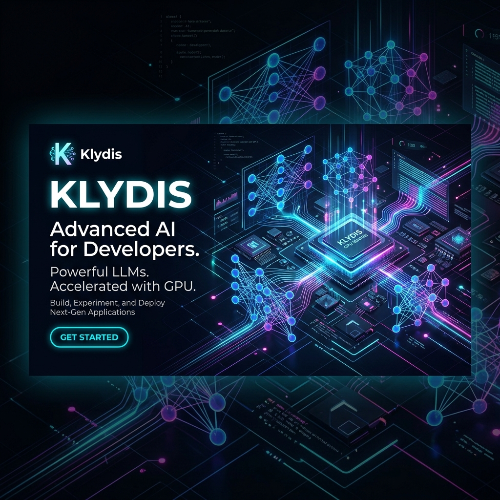
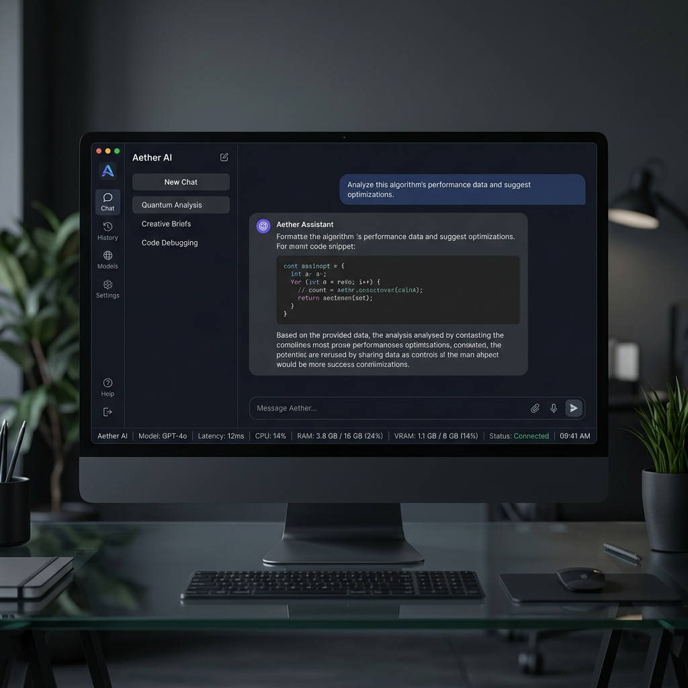

<div align="center">



# KlydisBeta

**A high-performance, self-contained LLM inference engine and chat application for Windows.**

</div>

## 🚀 Overview

**KlydisBeta** is a modern, dark-themed WPF desktop application that brings the power of Large Language Models (LLMs) directly to your local machine. Built entirely on **.NET 9** and **LLamaSharp**, it eliminates the need for external local servers (like Ollama) by embedding the inference engine directly within the application process.

This seamless integration ensures maximum efficiency, lower latency, and deep hardware awareness for executing GGUF models locally using your GPU (CUDA) and CPU.

## ✨ Features

- **In-Process Inference:** No external servers required. Loads and executes GGUF models directly within the app using LLamaSharp.
- **Hardware Acceleration:** Native support for CUDA 12, AVX2, and AVX-512 to maximize throughput.
- **Real-Time Hardware Monitoring:** Built-in system profiler tracking exact CPU, System RAM, and GPU VRAM usage during generation.
- **Dynamic Offload Strategies:** Automatically optimizes memory loading and layer offloading based on your available hardware.
- **Stateless Execution:** Utilizes `StatelessExecutor` to ensure multi-turn conversations remain pristine without cache corruption.
- **Modern User Interface:** A sleek, fully customized dark-mode WPF layout featuring a sidebar, chat area, model library, and status bar.

<div align="center">
  
  <br>
  <em>Clean, developer-focused aesthetic.</em>
</div>

## 🛠️ Architecture

KlydisBeta is broken down into two main components:

1. **`Klydis.Core`**: The brain of the application.
   - **`InferenceEngine`**: Manages the LLamaSharp context, weights, and `StatelessExecutor`. Configured for optimal performance (`FlashAttention`, optimized Batch Threads, and F16 KV caching).
   - **Hardware Profilers**: `SystemProfiler` and `GpuProfiler` tap into Windows WMI and native APIs to provide real-time metrics.
   - **Memory**: Context orchestrators and message stores backed by SQLite for robust session persistence.

2. **`Klydis.App`**: The UI Layer.
   - Built on WPF (Windows Presentation Foundation) with custom window chrome.
   - Uses the MVVM design pattern.
   - Beautiful, custom XAML themes (`ThemeBrushes`, `ThemeColors`, `ThemeStyles`) enforcing a sleek dark-mode aesthetic.

## 📦 Getting Started

### Prerequisites
- Windows 10/11 (x64)
- .NET 9.0 SDK
- For GPU acceleration: A compatible NVIDIA GPU with CUDA 12 installed.

### Build and Run

1. Clone the repository:
   ```bash
   git clone https://github.com/obsidian-pixel-backup/klydisbeta.git
   cd klydisbeta
   ```

2. Build the solution:
   ```bash
   dotnet build
   ```

3. Run the application:
   ```bash
   # Or simply execute Start-Klydis.bat
   dotnet run --project src/Klydis.App/Klydis.App.csproj
   ```

## 🧠 Model Support

KlydisBeta natively supports `.gguf` format models. Simply download your favorite models from HuggingFace (e.g., Llama-3, Mistral, Phi-3), place them in the designated models directory, and select them from the application's Model Library tab.

## 🤝 Contributing

Contributions, issues, and feature requests are welcome! Feel free to check the [issues page](https://github.com/obsidian-pixel-backup/klydisbeta/issues).

---

<div align="center">
  <sub>Built with ❤️ using C#, .NET 9, and LLamaSharp.</sub>
</div>
