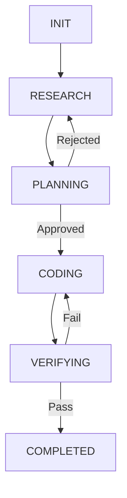

# Agentic Workflow State Machines

Long-running agentic tasks require state machine graphs to maintain execution state across disconnects, tool delays, or human-in-the-loop validation steps.

## Core Architectural Concepts

1. **Deterministic State Graph**: Define explicitly labeled state nodes (`INIT`, `RESEARCH`, `PLANNING`, `CODING`, `VERIFYING`, `COMPLETED`, `FAILED`).
2. **State Serialization**: Save workflow state to JSON checkpoints after every state transition.
3. **Directed Acyclic Graph (DAG) Execution**: Structure dependencies cleanly to support parallel subtask execution and failure rollbacks.

---

## Workflow State Diagram



---

## Checkpoint File Schema (`state_checkpoint.json`)

```json
{
  "workflow_id": "wf-948102",
  "current_state": "VERIFYING",
  "state_history": [
    { "state": "INIT", "timestamp": "2026-07-26T19:00:00Z" },
    { "state": "RESEARCH", "timestamp": "2026-07-26T19:01:00Z" },
    { "state": "CODING", "timestamp": "2026-07-26T19:03:00Z" }
  ],
  "context_data": {
    "target_files": ["src/api/users.ts"],
    "unit_test_status": "RUNNING"
  },
  "retry_count": 1
}
```

---

## Verification Checklist

- [ ] Workflow transitions are explicitly validated against state graph rules.
- [ ] Checkpoint JSON files are saved atomically (`write-then-rename`) to avoid corruption.
- [ ] Failed states trigger explicit recovery or rollback procedures.
- [ ] Long-running steps support pause and resume mechanisms cleanly.
