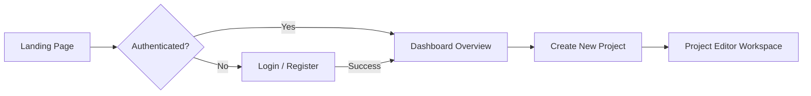

# UX Information Architecture & User Flow Design

Information Architecture (IA) organizes, structures, and labels software content so users can intuitively find information and complete tasks efficiently.

## Core Principles

1. **Alignment with User Mental Models**: Structure menus and features around how users think about their goals, not internal backend database tables.
2. **Flat Navigation Hierarchy**: Keep page navigation depth under 3 clicks ($3\text{-click rule}$) from the primary dashboard.
3. **Clear Breadcrumb Trails**: Provide visual indicators showing users where they are in the application hierarchy.

---

## User Flow Diagramming Standard

---

## Verification Checklist

- [ ] Global navigation items are labeled with familiar, plain-language terminology.
- [ ] Users can return to the primary dashboard view in a single click.
- [ ] Deeply nested pages display breadcrumb navigation paths (`Home > Projects > Settings`).
