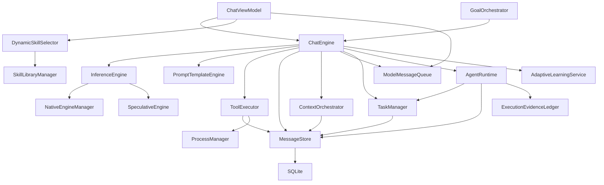

# Klydis Beta — Dependency Map

> Phase 0 — DI wiring and component dependency graph.

## Construction Chain

`ChatEngine` is constructed by `ChatViewModel` (in `Klydis.App`) with these dependencies:

```
ChatEngine(
    inferenceEngine:       InferenceEngine        ← LLamaSharp, NativeEngineManager
    promptEngine:          PromptTemplateEngine
    toolExecutor:          ToolExecutor            ← MessageStore, ProcessManager
    messageStore:          MessageStore            ← SQLite (WAL mode)
    contextOrchestrator:   ContextOrchestrator     ← MessageStore
    logger:                ILogger<ChatEngine>
    messageQueue:          ModelMessageQueue       ← MessageStore
    vectorStore:           VectorStore?
    adaptiveLearning:      AdaptiveLearningService?
    taskManager:           TaskManager             ← MessageStore
    agentRuntime:          AgentRuntime            ← TaskManager, MessageStore
)
```

## Dependency Graph



## Key Observations for Hardening

1. **ChatEngine is the hub** — it depends on almost everything. Phase 1 must invert this so `AgentRuntime` becomes the hub.
2. **AgentRuntime has minimal dependencies** — only `TaskManager` and `MessageStore`. It can be extracted cleanly.
3. **GoalOrchestrator wraps ChatEngine** — it's a secondary execution path that must be reconciled.
4. **DynamicSkillSelector is called from ChatViewModel** — not from the runtime. Phase 4 moves it.
5. **ToolExecutor is massive (~4,300 lines)** — it's both tool execution AND mutation pipeline. Future phases may split it.

## Static vs Instance Classes

| Component | Kind | Notes |
|---|---|---|
| `AgentSupervisor` | `static class` | Pure, no state |
| `ActionGate` | `static class` | Pure, no state |
| `ExecutionDispatcher` | `static class` | Pure, no state |
| `TaskStateMachine` | `static class` | Pure, no state |
| `AgentLoopStateMachine` | `static class` | Pure, no state |
| `TaskStepBuilder` | `static class` | Pure, no state |
| `StepClassifier` | `static class` | Pure, no state |
| `InteractionClassifier` | `static class` | Pure, no state |
| `AgentRuntime` | Instance | Holds `_activeRuns`, `_evidenceLedger` |
| `ChatEngine` | Instance | Holds session state, history, turn gate |
| `TaskManager` | Instance | Holds store reference |
| `MessageStore` | Instance | Holds SQLite connection |
